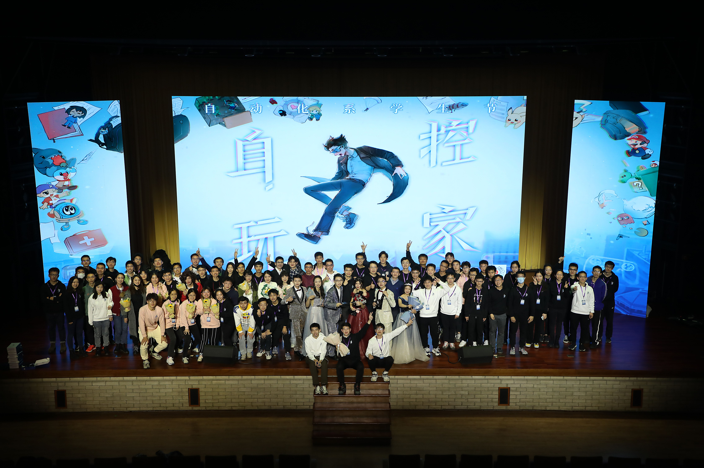
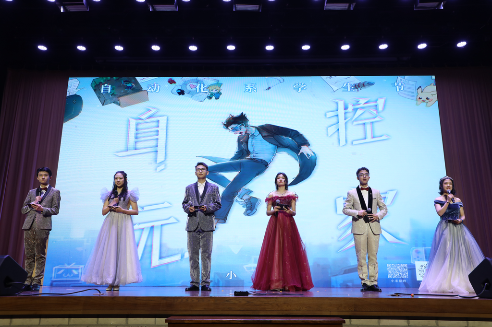

## Overall experiences:

> 2021's Students Festival of Department of Automation

* Served as a stage director in 2021.

      

<!--  -->
   

> 2022's Students Festival of Department of Automation

* Served as a hostress in 2022.

       

   

> Sports Participation

* Competed in John Ma Cup badminton competitions of female-doubles and mixed-doubles and won championship for the Department of Automation in 2021.
* Joined karate team, competed in John Ma Cup competition and got top-8 awards in individual and team events in 2020.
   

---

##  Timeline: 2022

<!-- > ## Intro… -->

> * An important person came into my life.🥳
<!-- > * Spending two days with Annie makes me understand myself more. Be relax and just be myself.🤩 -->

### 1. Research

* Out-of-Dynamics Imitation Learning from Multi-modal demonstrations --- with Jialong, Zhangjie, Prof. Long.

* Hybrid Dynamics-aware Offline-and-Online Reinforcement Learning --- with Haoyi, Shubham, Prof. Zhan.

### 2. Person I met

> Glad to work with these people.

* Haoyi, Jianxiong, Zhe, ..., and Prof. Zhan
  <!-- They give me precious joyful moments in all the stress. I see passion and warmths, and I begin to believe that that's what scientific research can also be like. :) To gain some confidence in the fields we study, and feeling proud as well as humble for making a little contribution, no matter how little, but still as much as we could do within our capability. -->

* Prof. Ma, Prof. Jiang, and Shengquan.

  <!-- Thanks to them to give me a chance to get to know compu-Bio. Gap between solving real-world problems and developing better algorithms is HUGE. Hope to dig deeper in the latter field, so that one day I would know how to deal with the first. It is about thinking more orinially about science. :) -->

* Mr. Shang

  <!-- He is the one who has changed my mind into becoming a p.h.D. 🙌🏼 He provided me with wise suggestions and saved me from a mess. "Do things I have to do, for now." -->

* Jialong

  <!-- Maybe he is the person I spent most time with and who always urged me about the research and scolded me the most, who always chase high efficiency and quality. This is another way of life that I admire --- pure love for truth and stability /peace.  -->

### 3. Life Pieces.

* A picnic at Olympics.
* A sunrise on May. 20, 2022.
* A glimpse of snow mountain, resulted from an impulse for chasing a beautiful feeling that I do not know will last for how long, but precious it. Give it a shot. 🤪

> Things I want to say at the end:
> **Thinking about the present. Live at the present and don't care about the result.**

---

##  Timeline: 2021

<!-- > ## Intro… -->

<!-- > * Heard from a friend that he was admitted to MIT. Material Science Ph.D. I felt happy for him!
> * Compared with receiving an offer, what I wished more for is finding the field of study that I love, just like him, although he joked that his major is one of ’The-4-Pitfalls’.

* From 2021/07, the moment I decided in an instance, jumped onto my bike,  rushed through the campus, knocked on that door,  I knew that my life has been on a new track. -->

### 1. Research

* Universal Domain Adaptation --- with Zhangjie.

* Domain Generalization ---  with Shu.

It was a pity that none of these methods worked out. But the most important thing is what I learned in the process -- how to get hands dirty and get things done. If one way doesn't work out, find another. Repeat it for 1,000 times.

### 2. Person I met

> I'm lucky to get to know them.

* Mrs. Wang
  
  <!-- She’s the one who can actually look through me, and offer me advice that I needed the most.
  When she asked, *what kind of person you want to become*? I stumbled,  hearing my self saying I don’t know. But she spoke, ‘You do know, ... You want to be an interesting one. ’
 -->
* Mr. Fan

  <!-- He is the one who tells me what does it mean to be an engineer in the first place. To find an elephant, and the refrigerator, and step by step work out what needs to be done to achieve my goal. -->

* Mr. Long

  <!-- He is the one who shows me the passion for scientific research. And that it's not conflict with the short-term goal we target at. Just aim high and work hard. 🤟🏼✊🏼 -->

  

* At last, all of the extraordinary senior who had guided me: Zhangjie,  Shu,  Ximei, Junguang,  Haixu, Baixu, ...
  Meeting them was like a dream to me.

### 3. Life Pieces.

* Stood on the stage of the students festival.
* Launched Project P2P, as mysterious JQK, bring company to the young.
* Met and made interviews with the experienced --- Xuehui Wang, Yu wang, ...

> Things I want to say at the end:
> Ask myself, ***what do I want, and how do I get there?***

