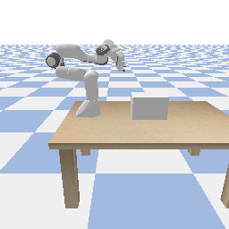

## 1. When to Trust Your Simulator: Dynamics-Aware Hybrid Offline-and-Online Reinforcement Learning. [arxiv](https://arxiv.org/abs/2206.13464v1)

  In submission to NeurIPS 2022.
> Haoyi Niu, Shubham Sharma, **Yiwen Qiu**, Ming Li, Guyue Zhou, Jianming Hu, Xianyuan Zhan

**Abstract**: Is it possible to combine learning from limited real data in offline RL and unrestricted exploration through imperfect simulators in online RL to address the drawbacks of both approaches? In this study, we propose the Dynamics-Aware Hybrid Offline-and-Online Reinforcement Learning (H2O) framework to provide an affirmative
 answer to this question. H2O introduces a dynamics-aware policy evaluation
 scheme, which adaptively penalizes the Q function learning on simulated state-
action pairs with large dynamics gaps, while also simultaneously allowing learning
 from a fixed real-world dataset.

<figure>
<!-- <figcaption>Baseline

<figcaption>ID 

<figcaption>ID-GAIl

<figcaption>f-MDP -->
<!-- 
<figcaption>Ours -->

<!-- <figcaption>Illustrations for transferable demonstrations. -->
</figure>

## 2. Out-of-Dynamics Imitation Learning from Multimodal Demonstrations

  Accepted by CoRL 2022.

> **Yiwen Qiu**, Jialong Wu, Zhangjie Cao, Mingsheng Long

**Abstract**: Existing imitation learning works mainly assume that the demonstrator who collects demonstrations share the same dynamics as the imitator. However, the assumption limits the usage of imitation learning, especially when collecting demonstrations for the imitator is difficult. In this paper, we study out-of-dynamics imitation learning (OOD-IL), which relaxes the assumption to that the demonstrator and the imitator have the same state spaces but could have different action spaces and dynamics. **OOD-IL enables imitation learning to utilize demonstrations from a wide range of demonstrators** but introduces a new challenge: some demonstrations cannot be achieved by the imitator due to the different dynamics. We **firstly** design a novel sequence-based contrastive clustering algorithm to cluster demonstrations from the same mode to avoid the mutual interference of demonstrations from different modes, and then **learn the transferability** of each demonstration with an adversarial-learning based algorithm in each cluster.  We show the videos of our experiment results on our [website](https://sites.google.com/view/oodil).

<!-- 
  You can also find my articles on <u><a href="{{author.googlescholar}}">my Google Scholar profile</a>.</u>





  
 -->

<figure>
<!-- <figcaption>Baseline

<figcaption>ID 

<figcaption>ID-GAIl

<figcaption>f-MDP -->
<!-- 
<figcaption>Ours -->

<!-- <figcaption>Illustrations for transferable demonstrations. -->
</figure>

