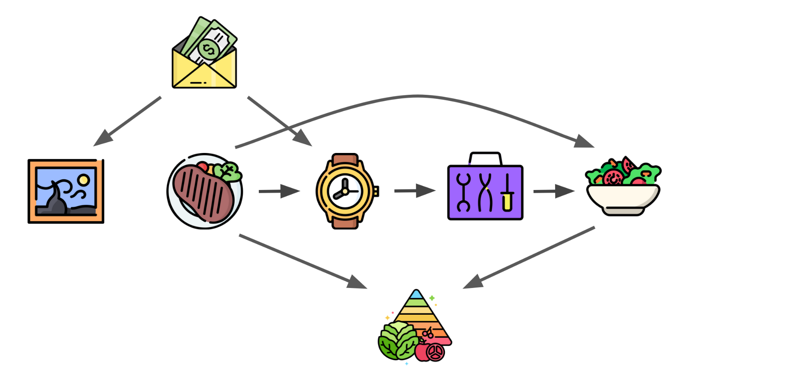

### 1. Identifying Selections for Unsupervised Subtask Discovery. [[arxiv](https://arxiv.org/pdf/2410.21616v1)] (NeurIPS 2024)

**Yiwen Qiu**, Yujia Zheng, Kun Zhang

    

### 2. Detecting and Identifying Selection Structure in Sequential Data. [[arxiv](https://arxiv.org/pdf/2407.00529)] (ICML 2024)

Yujia Zheng, Zeyu Tang, **Yiwen Qiu**, Bernhard Schölkopf, Kun Zhang

    

<!-- Abstract: We argue that the selective inclusion of data points based on latent objectives is common in practical situations, such as music sequences. Since this selection process often distorts statistical analysis, previous work primarily views it as a bias to be corrected and proposes various methods to mitigate its effect. However, while controlling this bias is crucial, selection also offers an opportunity to provide a deeper insight into the hidden generation process, as it is a fundamental mechanism underlying what we observe. In particular, overlooking selection in sequential data can lead to an incomplete or overcomplicated inductive bias in modeling, such as assuming a universal autoregressive structure for all dependencies. Therefore, rather than merely viewing it as a bias, we explore the causal structure of selection in sequential data to delve deeper into the complete causal process. Specifically, we show that selection structure is identifiable without any parametric assumptions or interventional experiments. Moreover, even in cases where selection variables coexist with latent confounders, we still establish the nonparametric identifiability under appropriate structural conditions. Meanwhile, we also propose a provably correct algorithm to detect and identify selection structures as well as other types of dependencies. The framework has been validated empirically on both synthetic data and real-world music. -->

### 3. Data-driven predictive control using closed-loop data: An instrumental variable approach. [[arxiv](https://arxiv.org/pdf/2309.05916)] (IEEE Control Systems Letters, 2023)

Yibo Wang, **Yiwen Qiu**, Malika Sader, Dexian Huang, Chao Shang

<!-- Abstract: Current data-driven predictive control (DDPC)
methods heavily rely on data collected in open-loop operation
with elaborate design of inputs. However, due to safety or
economic concerns, systems may have to be under feedback
control, where only closed-loop data are available. In this
context, it remains challenging to implement DDPC using
closed-loop data. In this paper, we propose a new DDPC method
using closed-loop data by means of instrumental variables (IVs).
By drawing from closed-loop subspace identification, the use of
two forms of IVs is suggested to address the closed-loop issues
caused by feedback control and the correlation between inputs
and noise. Furthermore, a new DDPC formulation with a novel
IV-inspired regularizer is proposed, where a balance between
control cost minimization and weighted least-squares data
fitting can be made for improvement of control performance.
Numerical examples and application to a simulated industrial
furnace showcase the improved performance of the proposed
DDPC based on closed-loop data. -->

### 4. Out-of-Dynamics Imitation Learning from Multimodal Demonstrations. [[OpenReview](https://openreview.net/forum?id=X6CjiTWVRVr)][[arxiv](https://arxiv.org/abs/2211.06839v1)] (CoRL 2022)

**Yiwen Qiu**, Jialong Wu, Zhangjie Cao, Mingsheng Long

<!-- **Abstract**: Existing imitation learning works mainly assume that the demonstrator who collects demonstrations share the same dynamics as the imitator. However, the assumption limits the usage of imitation learning, especially when collecting demonstrations for the imitator is difficult. In this paper, we study out-of-dynamics imitation learning (OOD-IL), which relaxes the assumption to that the demonstrator and the imitator have the same state spaces but could have different action spaces and dynamics. **OOD-IL enables imitation learning to utilize demonstrations from a wide range of demonstrators** but introduces a new challenge: some demonstrations cannot be achieved by the imitator due to the different dynamics. We **firstly** design a novel sequence-based contrastive clustering algorithm to cluster demonstrations from the same mode to avoid the mutual interference of demonstrations from different modes, and then **learn the transferability** of each demonstration with an adversarial-learning based algorithm in each cluster.  We show the videos of our experiment results on our [website](https://sites.google.com/view/oodil). -->

    
    <!-- <figcaption>{ includeresults on our [website](https://sites.google.com/view/oodil)}</figcaption> -->

### 5. When to Trust Your Simulator: Dynamics-Aware Hybrid Offline-and-Online Reinforcement Learning. [[arxiv](https://arxiv.org/abs/2206.13464v1)] (NeurIPS 2022 *Spotlight*)

Haoyi Niu, Shubham Sharma, **Yiwen Qiu**, Ming Li, Guyue Zhou, Jianming Hu, Xianyuan Zhan

<!-- **Abstract**: Is it possible to combine learning from limited real data in offline RL and unrestricted exploration through imperfect simulators in online RL to address the drawbacks of both approaches? In this study, we propose the Dynamics-Aware Hybrid Offline-and-Online Reinforcement Learning (H2O) framework to provide an affirmative
 answer to this question. H2O introduces a dynamics-aware policy evaluation
 scheme, which adaptively penalizes the Q function learning on simulated state-
action pairs with large dynamics gaps, while also simultaneously allowing learning
 from a fixed real-world dataset. -->

    

